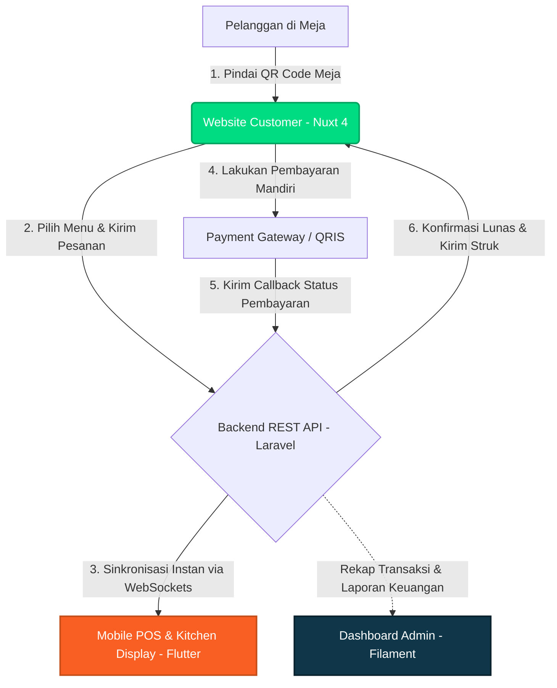

#  Santap Web — Website Pemesanan Mandiri & Layanan Mandiri Pelanggan

[](https://nuxt.com)
[](https://santap.app)
[](#-alur-sinkronisasi-real-time)

**Santap Web** adalah aplikasi front-end modern berbasis web yang dirancang khusus untuk pelanggan restoran dan kafe. Bagian dari ekosistem **Santap POS**, aplikasi ini memungkinkan pelanggan melakukan pemesanan mandiri, menambah pesanan secara fleksibel, dan membayar secara instan langsung dari meja mereka tanpa perlu mengunduh aplikasi tambahan atau melakukan registrasi yang rumit.

---

## ✨ Fitur Unggulan (Fokus Pengalaman Pelanggan)

### 📱 1. Pemesanan Mandiri Instan (QR Table Order)
Cukup pindai kode QR unik yang ada di meja makan menggunakan kamera ponsel pintar Anda. Anda akan langsung diarahkan ke halaman menu digital restoran yang interaktif, cepat, dan responsif.
*   **Tanpa Instal Aplikasi:** Tidak perlu membuang memori ponsel untuk mengunduh aplikasi tambahan.
*   **Tanpa Login/Registrasi:** Masuk, pilih menu, dan pesan langsung dalam hitungan detik.

### 🔄 2. Sistem Pesanan Berkelanjutan (Open Bill)
Ingin memesan hidangan pembuka dulu lalu menambah makanan utama atau pencuci mulut nanti? Santap memfasilitasi hal tersebut dengan lancar.
*   **Tambah Pesanan Kapan Saja:** Pesanan tambahan akan otomatis diakumulasikan ke dalam satu tagihan meja Anda.
*   **Update Dapur Instan:** Setiap pesanan baru langsung terkirim dan ter-update di layar dapur (*Kitchen Display*) dalam waktu kurang dari 30 detik.

### 💳 3. Pembayaran Digital Terintegrasi (QRIS & E-Wallet)
Bayar pesanan Anda secara mandiri langsung dari meja tanpa harus berjalan dan mengantre di meja kasir.
*   **Pilihan Pembayaran Lengkap:** Mendukung QRIS (GoPay, OVO, DANA, ShopeePay, LinkAja) serta metode transfer bank lainnya.
*   **Struk Digital Otomatis:** Setelah pembayaran sukses terverifikasi, struk digital akan langsung diterbitkan di layar ponsel Anda sebagai bukti pembayaran sah.

### 🎨 4. Halaman Publik & Menu Restoran yang Menarik
Menampilkan katalog menu dengan foto hidangan berkualitas tinggi, detail harga, deskripsi bahan, informasi alergen, serta label khusus (seperti *Pedas*, *Favorit*, atau *Rekomendasi Koki*) guna membantu Anda memilih hidangan terbaik.

---

## 🔄 Alur Kerja Ekosistem Santap

Berikut adalah bagaimana Website Customer berkolaborasi secara real-time dengan seluruh perangkat operasional restoran lainnya dalam ekosistem Santap POS:



---

## 🚀 Manfaat untuk Pemilik Bisnis Kuliner (Mitra Santap)

Dengan mengaktifkan fitur pemesanan mandiri dari Santap Web di restoran Anda, Anda mendapatkan berbagai keuntungan bisnis yang nyata:
*   **Meningkatkan Turnaround Meja:** Pelanggan tidak perlu menunggu pramusaji datang untuk mencatat pesanan atau mengantarkan bill, membuat sirkulasi meja menjadi lebih cepat.
*   **Zero Human Error:** Pesanan dicatat langsung oleh pelanggan sendiri, meminimalkan kesalahan komunikasi pesanan makanan oleh pelayan.
*   **Efisiensi Tenaga Kerja:** Pramusaji dapat lebih fokus menyajikan makanan dengan ramah dan menjaga kebersihan area makan daripada terus-terusan menginput pesanan secara manual.
*   **Rekonsiliasi Kasir Otomatis:** Pembayaran QRIS langsung dicocokkan dengan pesanan di meja secara real-time, menghindari kecurangan kasir dan mempermudah audit keuangan di akhir shift.

Untuk mempelajari lebih lanjut tentang bagaimana Santap dapat mentransformasi bisnis kuliner Anda, kunjungi website resmi kami di [https://santap.app](https://santap.app).

---

<details>
<summary><b>🛠️ Panduan Pengembangan & Teknisi (Developer Hub)</b></summary>

Dokumentasi ini ditujukan bagi tim developer yang ingin memodifikasi atau berkontribusi pada pengembangan aplikasi front-end Santap Web.

### Teknologi Utama yang Digunakan
*   **Framework:** Nuxt 4 (Vue.js 3)
*   **Bahasa Pemrograman:** TypeScript
*   **Runtime & Package Manager:** Bun

### 📦 Setup & Instalasi

1. Pastikan Anda telah menginstal [Bun](https://bun.sh) pada komputer lokal Anda.
2. Pasang semua dependensi proyek:
   ```bash
   bun install
   ```
3. Salin file contoh konfigurasi environment:
   ```bash
   cp .env.example .env
   ```
4. Konfigurasikan variabel lingkungan pada berkas `.env` sesuai kebutuhan pengembangan Anda:
   *   **Menggunakan Mock API (Tanpa server backend aktif):**
       ```env
       NUXT_PUBLIC_USE_MOCK_API=true
       ```
   *   **Menghubungkan ke Backend Lokal/Staging:**
       ```env
       NUXT_PUBLIC_API_BASE_URL=http://localhost:8000
       NUXT_PUBLIC_USE_MOCK_API=false
       ```
   > ℹ️ *Catatan: Secara default pada production (tanpa env khusus), aplikasi mengarah langsung ke API backend production di `https://api.santap.app`.*

### 💻 Menjalankan Server Lokal (Development)

Jalankan perintah berikut untuk memulai server lokal dengan fitur hot-reload:
```bash
bun run dev
```
Setelah berjalan, akses situs melalui peramban di alamat `http://localhost:3000`.

### 🛡️ Quality Gate & Pengujian

Sebelum melakukan komit atau menggabungkan perubahan kode baru, pastikan seluruh pemeriksaan berikut berhasil tanpa error:

```bash
# Memeriksa static typing TypeScript
bun run typecheck

# Menjalankan linter kode (sementara diarahkan ke nuxt typecheck)
bun run lint

# Menjalankan unit testing / integration testing
bun run test

# Melakukan compile dan build produksi lokal untuk memvalidasi buildability
bun run build
```

### 📖 Dokumen Referensi Tambahan
*   [Panduan Gaya & Sistem Desain (Style Guide)](style.md)
*   [Dokumentasi Analisis Masalah Aktif (Active Issues)](docs/active_issues.md)

</details>
